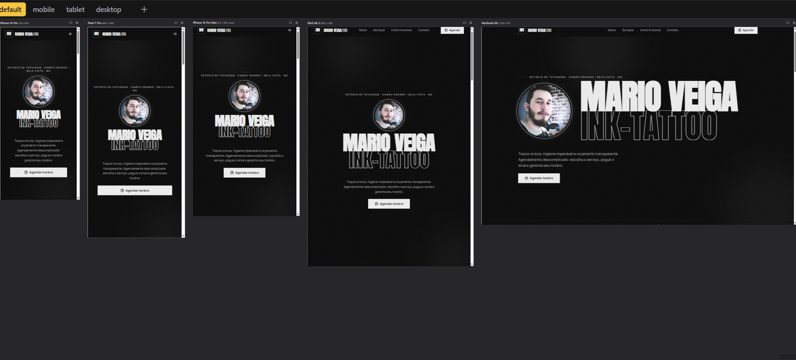
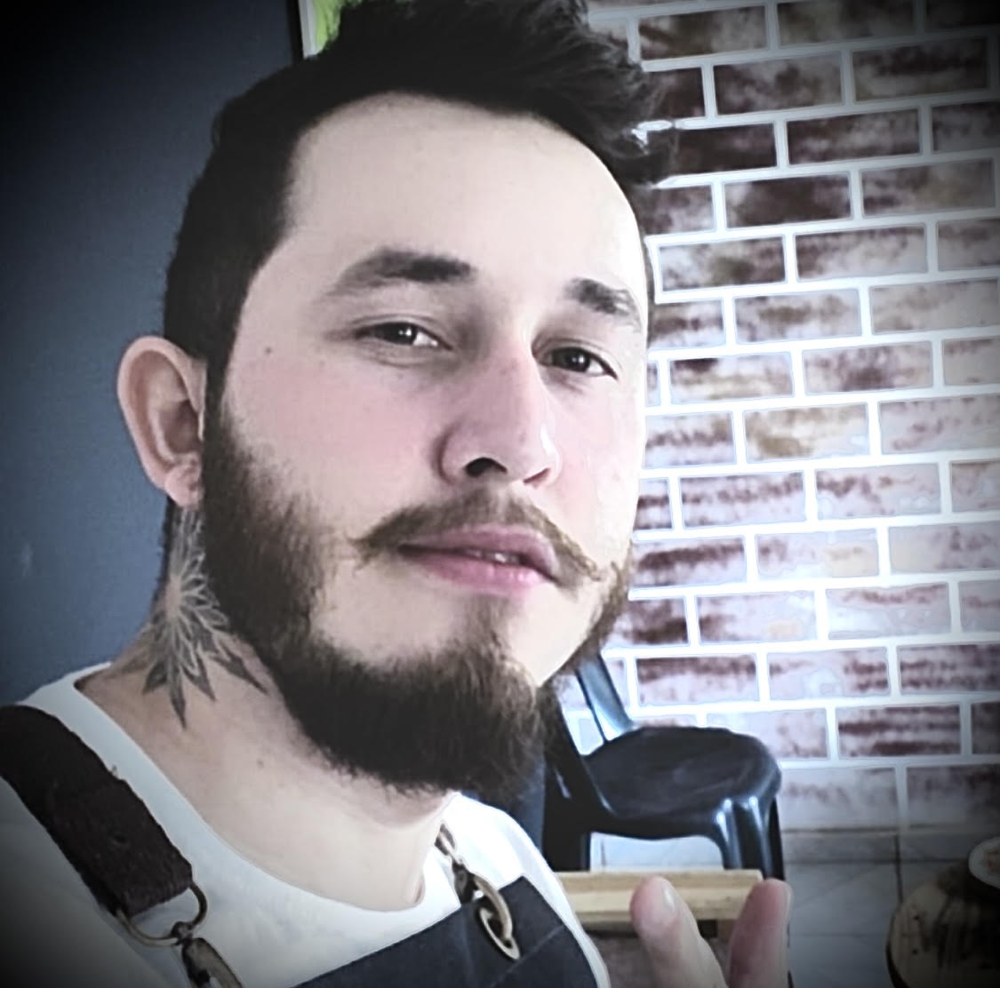
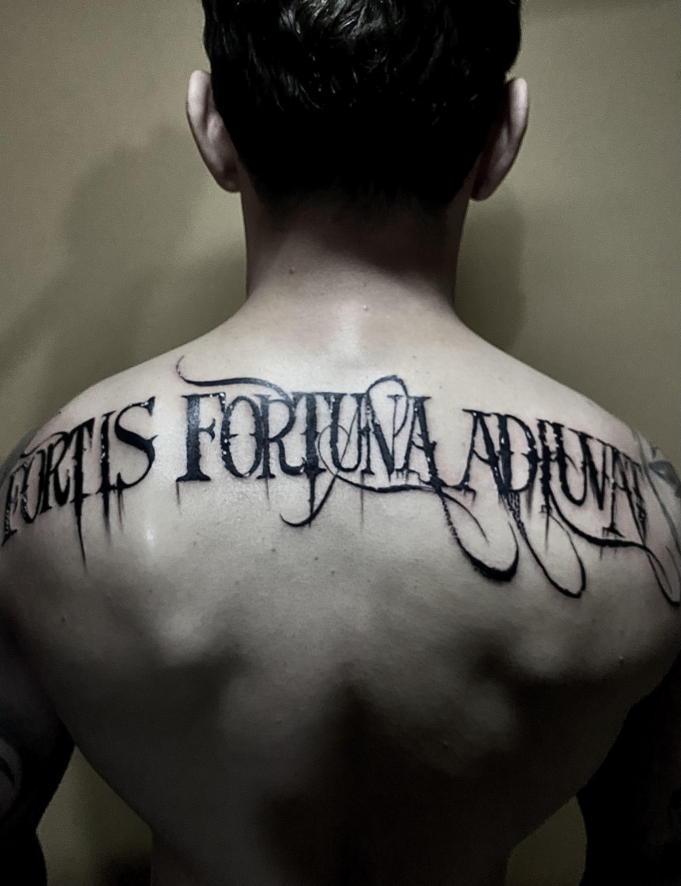

<p align="center">
	
</p>
<h1 align="center">Mario Veiga Ink-Tattoo</h1>
 
<p align="center">
	Site institucional e de agendamento para estúdio de tatuagem em Bela Vista e Campo Grande, MS.
</p>
<p align="center">
	
	
	
	
</p>
<p align="center">
	<a href="https://instagram.com/marioveiga_inktattoo">Instagram do estúdio</a>
</p>
---
 
## Sumário
 
- [Apresentação](#apresentação)
- [Pré-visualização](#pré-visualização)
- [Galeria](#galeria)
- [Funcionalidades](#funcionalidades)
- [Fluxo de agendamento](#fluxo-de-agendamento)
- [Tecnologias](#tecnologias)
- [Executar o site](#executar-o-site)
- [Estrutura do projeto](#estrutura-do-projeto)
- [Configuração do estúdio](#configuração-do-estúdio)
- [Destaques técnicos](#destaques-técnicos)
## Apresentação
 
Projeto desenvolvido para apresentar o trabalho do tatuador e simplificar a jornada de reserva: o cliente conhece os serviços, escolhe um horário e segue para o pagamento do sinal via Pix.
 
A interface se adapta a dispositivos móveis, tablets e desktop, com identidade visual escura inspirada no universo da tatuagem, tipografia de impacto e foco em uma chamada clara para o agendamento.
 
## Pré-visualização
 
Layout testado em diferentes resoluções: iPhone 14 Pro, Pixel 7 Pro, iPhone 14 Pro Max, iPad Air 5 e MacBook Air.
 
<p align="center">
	
</p>
## Galeria
 
<table>
	<tr>
		<td align="center" width="50%">
			
			<br /><sub>Mario Veiga</sub>
		</td>
		<td align="center" width="50%">
			
			<br /><sub>Trabalho do estúdio</sub>
		</td>
	</tr>
</table>
## Funcionalidades
 
- **Página institucional** com apresentação, serviços, informações e contato.
- **Agendamento em etapas** com seleção de serviço, dados do cliente, data e horário.
- **Pix integrado** com geração local do código copia e cola e do QR Code para o sinal de 50%.
- **Confirmação via WhatsApp** com envio dos detalhes do agendamento para validação manual.
- **Layout responsivo** com navegação adaptada para celular (menu compacto) e desktop (menu completo).
- **Página 404** personalizada, mantendo a identidade visual do site.
## Fluxo de agendamento
 
1. O cliente escolhe o **serviço** desejado.
2. Informa seus **dados** de contato.
3. Seleciona **data e horário** disponíveis.
4. Recebe o **Pix copia e cola** e o **QR Code** referentes ao sinal de 50%.
5. Envia os detalhes pelo **WhatsApp** para a confirmação do estúdio.
## Tecnologias
 
| Camada   | Tecnologias                                          |
| -------- | ---------------------------------------------------- |
| Frontend | HTML, CSS e JavaScript puro, sem framework nem build |
 
## Executar o site
 
Não há dependências para instalar. Na raiz do projeto, inicie um servidor estático:
 
```bash
python -m http.server 8080
```
 
Acesse [http://localhost:8080](http://localhost:8080).
 
Também é possível abrir o `index.html` com uma extensão de servidor local do editor, como o Live Server do VS Code.
 
## Estrutura do projeto
 
```text
.
├── index.html
├── agendar.html
├── 404.html
├── assets/
│   ├── css/
│   ├── img/
│   │   └── screenshots/
│   └── js/
└── README.md
```
 
## Configuração do estúdio
 
Os dados do estúdio ficam centralizados em `assets/js/config.js`, incluindo:
 
- nome do estúdio;
- serviços e preços;
- horários de atendimento;
- informações de contato;
- dados usados para montar o Pix.
Para adaptar o site a outro estúdio, basta editar esse arquivo e substituir as imagens em `assets/img/`.
 
## Destaques técnicos
 
- Desenvolvimento *mobile first*, validado em diversos dispositivos.
- Projeto leve, sem dependências externas e sem etapa de build.
- Geração de Pix e QR Code feita inteiramente no navegador.
- Configuração centralizada, facilitando manutenção e reuso.
---
 
<p align="center">
	Desenvolvido por <strong>Mario Marcos Veiga Achucarro</strong><br />
	<a href="https://github.com/Marc0sVeiga">GitHub</a> · <a href="https://linkedin.com/in/mari0-marc0s">LinkedIn</a>
</p>